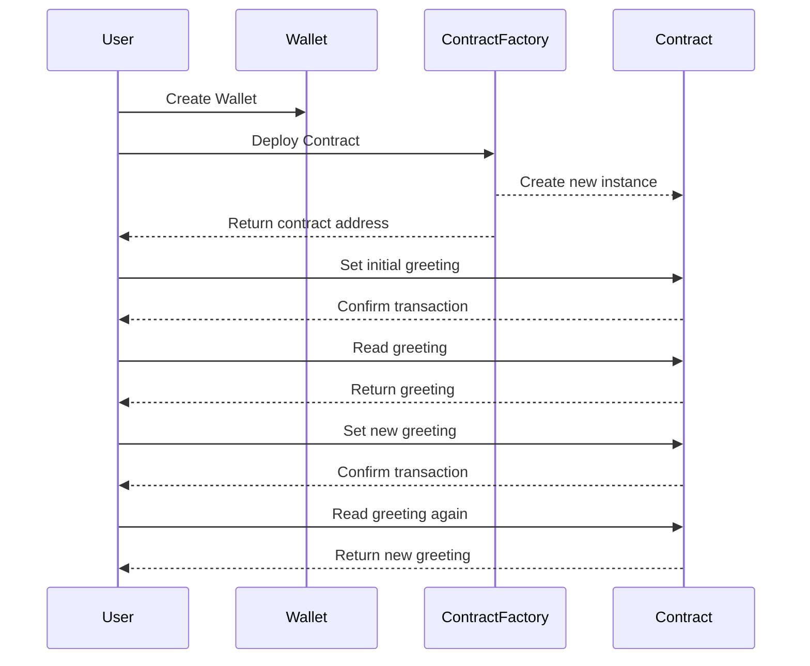

## HelloBase


This is the official repo for HelloBase.dev, a starting place for any developer who is interested in building onchain.

The app is composed of two pieces:

- Next.js client
- [Smart Contracts on Base Sepolia](https://github.com/PinataCloud/hello-base-contracts)

This repo contains the code for the Next.js client and uses a combination of [Wagmi.sh](https://wagmi.sh) and [Coinbase Smart Wallets](https://www.coinbase.com/wallet/smart-wallet) to provide a seemless experience for anyone to start building onchain. Below is a flow chart for the user experience and what happens behind the scenes.



## Development

First clone the repo and install dependencies

```
git clone https://github.com/PinataCloud/hello-base
cd hello-base
npm install
```

Update the `.env.example` to `.env.local` and fill in the environment variables

```
NEXT_PUBLIC_URL= # Hosted App URL
NEXT_PUBLIC_FACTORY_ADDRESS= # Address of deployed factory
```

Spin up the dev server

```
npm run dev
```
